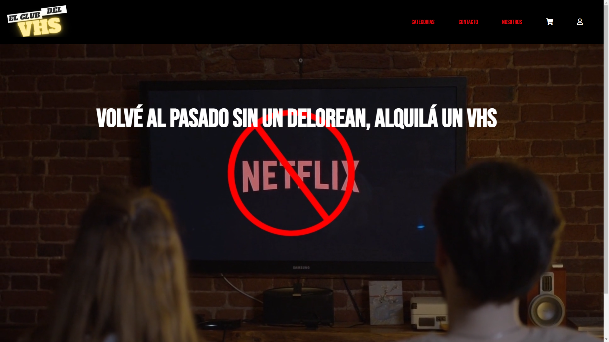

# El club del VHS
Somos una web dedicada al alquiler de películas y series. Pero no en cualquier formato!  

Contamos con un amplio catálogo íntegramente en formato VHS. 

Link: Rama Master, que obtiene los datos de Firebase [https://beer-armando.vercel.app/](https://beer-armando.vercel.app/)

Link: Rama Api, que obtiene los datos de la Api [https://beer-armando.herokuapp.com/](https://beer-armando.herokuapp.com/)

# Api de Peliculas

Link: [https://www.omdbapi.com/](https://www.omdbapi.com/)

### `npm start`

Runs the app in the development mode.\
Open [http://localhost:3000](http://localhost:3000) to view it in the browser.

# Dependencias agregadas 

### `npm i react-loading`
Dependecia utilizada para agregar logo de carga, mientras se termina de realizar el fetch.

Link: [https://www.npmjs.com/package/react-loading](https://www.npmjs.com/package/react-loading)

### `npm i react-router-dom`
Dependecia utilizada para generear un mecanismo de navegación en nuestra web

Link: [https://reactrouter.com/web/guides/quick-start](https://reactrouter.com/web/guides/quick-start)

### `npm install emailjs-com `
Dependecia utilizada para el envio de mails para la sección de contacto.

Link: [https://www.emailjs.com/docs/](https://www.emailjs.com/docs/)

